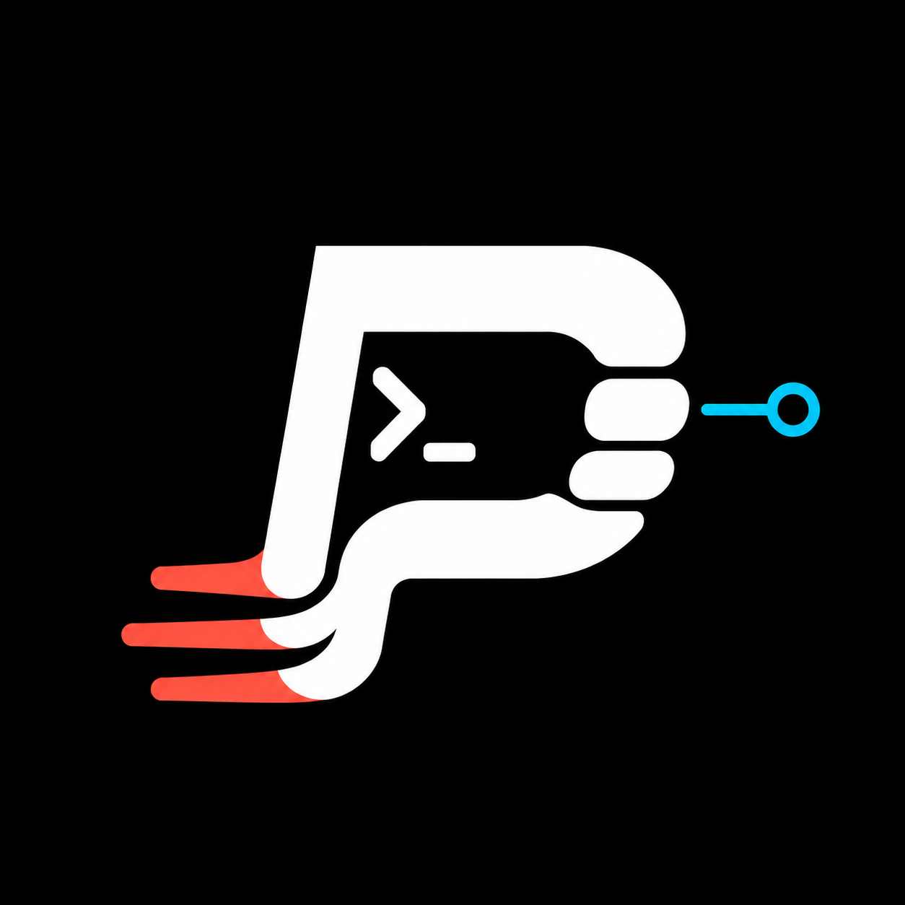

# punch

    

    
description

    <h2>What is punch?</h2> 
    
Punch is a simple, fast, and light-weight cli tool for linkin straight into your tickets/repos...

    <h2>Why did I build this?</h2>
    
because we all know your tabs fill up, and you lose track of where the hell you are. So vuala - now you have a tool that can just add more tabs on top of your tabs... lol...

idk... might be useful 🤷‍♂️
